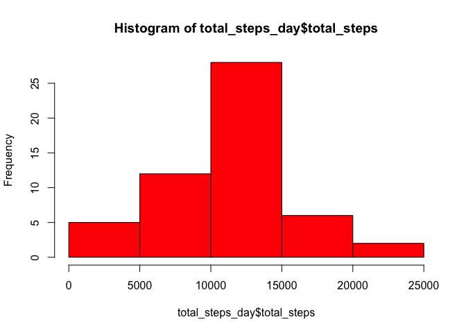
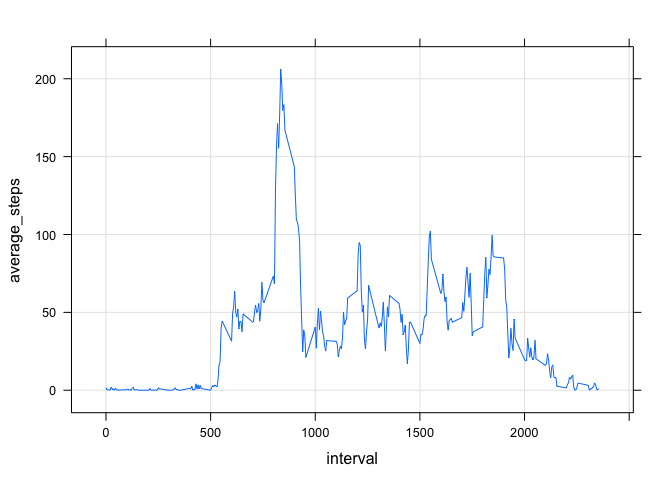
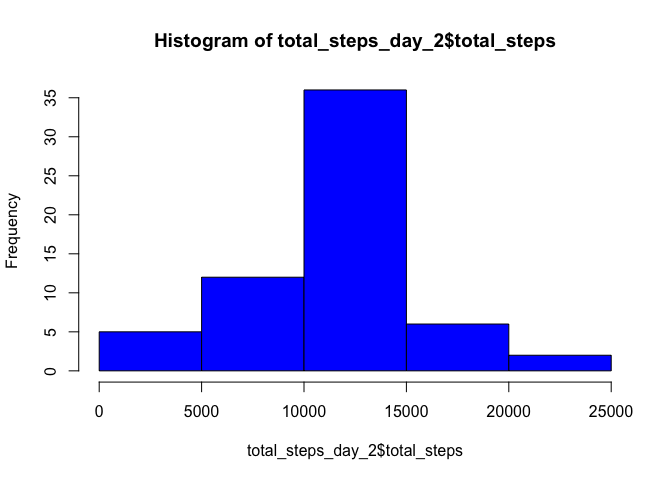
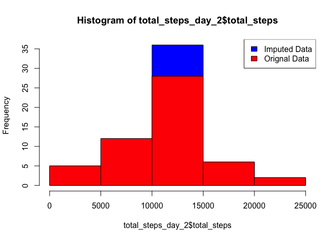
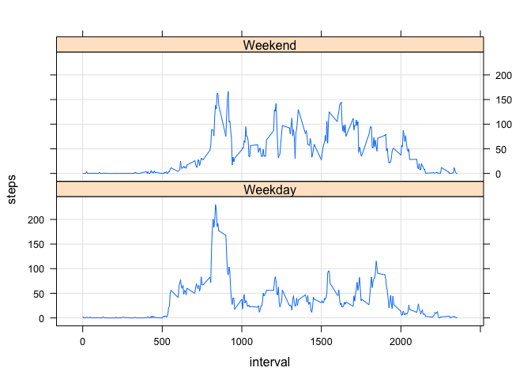

# Reproducible Research Project 1
Calvin Cox  
6/16/2017  


Loading and preprocessing the data

Show any code that is needed to

Load the data (i.e. 𝚛𝚎𝚊𝚍.𝚌𝚜𝚟())
Process/transform the data (if necessary) into a format suitable for your analysis


```r
# Downloading files
tech_url <-"https://d396qusza40orc.cloudfront.net/repdata%2Fdata%2Factivity.zip"
download.file(tech_url, "activity_monitoring_data.zip", mode="wb")
unzip("activity_monitoring_data.zip")
activity<-read.csv("activity.csv")
#summary(activity)
#str(activity)
```
What is mean total number of steps taken per day?

For this part of the assignment, you can ignore the missing values in the dataset.

Calculate the total number of steps taken per day
Make a histogram of the total number of steps taken each day


```r
library(plyr)
```

```
## Warning: package 'plyr' was built under R version 3.2.5
```

```r
library(ggplot2)
```

```
## Warning: package 'ggplot2' was built under R version 3.2.4
```

```r
total_steps_day<-ddply(activity,"date",summarise,total_steps=sum(steps))
total_steps_day
```

```
##          date total_steps
## 1  2012-10-01          NA
## 2  2012-10-02         126
## 3  2012-10-03       11352
## 4  2012-10-04       12116
## 5  2012-10-05       13294
## 6  2012-10-06       15420
## 7  2012-10-07       11015
## 8  2012-10-08          NA
## 9  2012-10-09       12811
## 10 2012-10-10        9900
## 11 2012-10-11       10304
## 12 2012-10-12       17382
## 13 2012-10-13       12426
## 14 2012-10-14       15098
## 15 2012-10-15       10139
## 16 2012-10-16       15084
## 17 2012-10-17       13452
## 18 2012-10-18       10056
## 19 2012-10-19       11829
## 20 2012-10-20       10395
## 21 2012-10-21        8821
## 22 2012-10-22       13460
## 23 2012-10-23        8918
## 24 2012-10-24        8355
## 25 2012-10-25        2492
## 26 2012-10-26        6778
## 27 2012-10-27       10119
## 28 2012-10-28       11458
## 29 2012-10-29        5018
## 30 2012-10-30        9819
## 31 2012-10-31       15414
## 32 2012-11-01          NA
## 33 2012-11-02       10600
## 34 2012-11-03       10571
## 35 2012-11-04          NA
## 36 2012-11-05       10439
## 37 2012-11-06        8334
## 38 2012-11-07       12883
## 39 2012-11-08        3219
## 40 2012-11-09          NA
## 41 2012-11-10          NA
## 42 2012-11-11       12608
## 43 2012-11-12       10765
## 44 2012-11-13        7336
## 45 2012-11-14          NA
## 46 2012-11-15          41
## 47 2012-11-16        5441
## 48 2012-11-17       14339
## 49 2012-11-18       15110
## 50 2012-11-19        8841
## 51 2012-11-20        4472
## 52 2012-11-21       12787
## 53 2012-11-22       20427
## 54 2012-11-23       21194
## 55 2012-11-24       14478
## 56 2012-11-25       11834
## 57 2012-11-26       11162
## 58 2012-11-27       13646
## 59 2012-11-28       10183
## 60 2012-11-29        7047
## 61 2012-11-30          NA
```

```r
hist(total_steps_day$total_steps,col="red")
```

<!-- -->


<b>Calculate and report the mean and median of the total number of steps taken per day</b>


```r
mean_steps_day<-mean(total_steps_day$total_steps,na.rm=TRUE)
mean_steps_day
```

```
## [1] 10766.19
```

```r
median_steps_day<-median(total_steps_day$total_steps,na.rm=TRUE)
median_steps_day
```

```
## [1] 10765
```


What is the average daily activity pattern?

Make a time series plot (i.e. 𝚝𝚢𝚙𝚎 = "𝚕") of the 5-minute interval (x-axis) and the average number of steps taken, averaged across all days (y-axis)
Which 5-minute interval, on average across all the days in the dataset, contains the maximum number of steps?


```r
library(lattice)

interval_avg_steps<-ddply(activity,"interval",summarise,average_steps=mean(steps,na.rm=TRUE))
#interval_avg_steps


xyplot(average_steps ~ interval, interval_avg_steps,type="l",grid = TRUE)
```

<!-- -->

```r
#Max average steps per 5 minute inteval.
max_avg<-which.max(interval_avg_steps$average_steps)
interval_avg_steps[max_avg,]
```

```
##     interval average_steps
## 104      835      206.1698
```


<b>Imputing missing values</b>  

Note that there are a number of days/intervals where there are missing values (coded as 𝙽𝙰). The presence of missing days may introduce bias into some calculations or summaries of the data.

Calculate and report the total number of missing values in the dataset (i.e. the total number of rows with 𝙽𝙰s)

Create a new dataset that is equal to the original dataset but with the missing data filled in.

Make a histogram of the total number of steps taken each day and Calculate and report the mean and median total number of steps taken per day.


```r
summary(activity)
```

```
##      steps                date          interval     
##  Min.   :  0.00   2012-10-01:  288   Min.   :   0.0  
##  1st Qu.:  0.00   2012-10-02:  288   1st Qu.: 588.8  
##  Median :  0.00   2012-10-03:  288   Median :1177.5  
##  Mean   : 37.38   2012-10-04:  288   Mean   :1177.5  
##  3rd Qu.: 12.00   2012-10-05:  288   3rd Qu.:1766.2  
##  Max.   :806.00   2012-10-06:  288   Max.   :2355.0  
##  NA's   :2304     (Other)   :15840
```

```r
sum(is.na(activity))
```

```
## [1] 2304
```

```r
# Imputing Missing Values. Missing values are replaced by averaging the values of each 5 minute interval

#Merge the activity dataset with the interval average dataframe - basically matching up the interval averages
# to the their respective intervals.
activity_interval_avg<-merge(activity,interval_avg_steps,by="interval")

#Create a new dataset that is equal to the original dataset but with the missing data filled in.
# Find and replace the NA values with the respective averages for each interval. 
activity_interval_avg$steps[is.na(activity_interval_avg$steps)] <- activity_interval_avg$average_steps[is.na(activity_interval_avg$steps)]

#activity_interval_avg
total_steps_day_2<-ddply(activity_interval_avg,"date",summarise,total_steps=sum(steps))


hist(total_steps_day_2$total_steps, col="blue")
```

<!-- -->

Make a histogram of the total number of steps taken each day and Calculate and report the mean and median total number of steps taken per day. 

<b>Do these values differ from the estimates from the first part of the assignment? </b>  
Yes, but not by much. Values are within 0.1% of each other.

<b>What is the impact of imputing missing data on the estimates of the total daily number of steps?</b>  
Imputing the data has very little inpact on the overall mean and median, which is desireable.  The biggest impact can be seen between 10000 and 15000 steps.


```r
hist(total_steps_day_2$total_steps,col="blue")

#overlapping original histogram on top of histogram with inputed data.
hist(total_steps_day$total_steps,col="red",add=T)
legend("topright", c("Imputed Data", "Orignal Data"), fill=c("blue", "red") )
```

<!-- -->


```r
mean_steps_day_2<-mean(total_steps_day_2$total_steps,na.rm=TRUE)
mean_steps_day_2
```

```
## [1] 10766.19
```

```r
#hist(interval_avg_steps$average_steps)
```


```r
median_steps_day_2<-median(total_steps_day_2$total_steps,na.rm=TRUE)
median_steps_day_2
```

```
## [1] 10766.19
```
<b>Are there differences in activity patterns between weekdays and weekends?</b>  
Yes, the activity patterns are different between weekdays and weekends.

Create a new factor variable in the dataset with two levels – “weekday” and “weekend” indicating whether a given date is a weekday or weekend day.

Make a panel plot containing a time series plot (i.e. 𝚝𝚢𝚙𝚎 = "𝚕") of the 5-minute interval (x-axis) and the average number of steps taken, averaged across all weekday days or weekend days (y-axis). 

```r
activity_interval_avg_wkday<-activity_interval_avg
activity_interval_avg_wkday$date<-as.Date(activity_interval_avg_wkday$date)
#activity_interval_avg_wkday

activity_interval_avg_wkday$weekdays<-weekdays(activity_interval_avg_wkday$date)
activity_interval_avg_wkday$weekdays_split<- ifelse(activity_interval_avg_wkday$weekdays=="Saturday" | 
                                                activity_interval_avg_wkday$weekdays =="Sunday", "Weekend","Weekday")
                                              
#str(activity_interval_avg_wkday)


interval_avg_steps<-ddply(activity,"interval",summarise,average_steps=mean(steps,na.rm=TRUE))

new_interval_avg_steps <- aggregate(steps ~ interval + weekdays_split, activity_interval_avg_wkday, mean)
#new_interval_avg_steps

xyplot(steps ~ interval|weekdays_split, new_interval_avg_steps,type="l",layout=c(1,2), grid = TRUE)
```

<!-- -->

